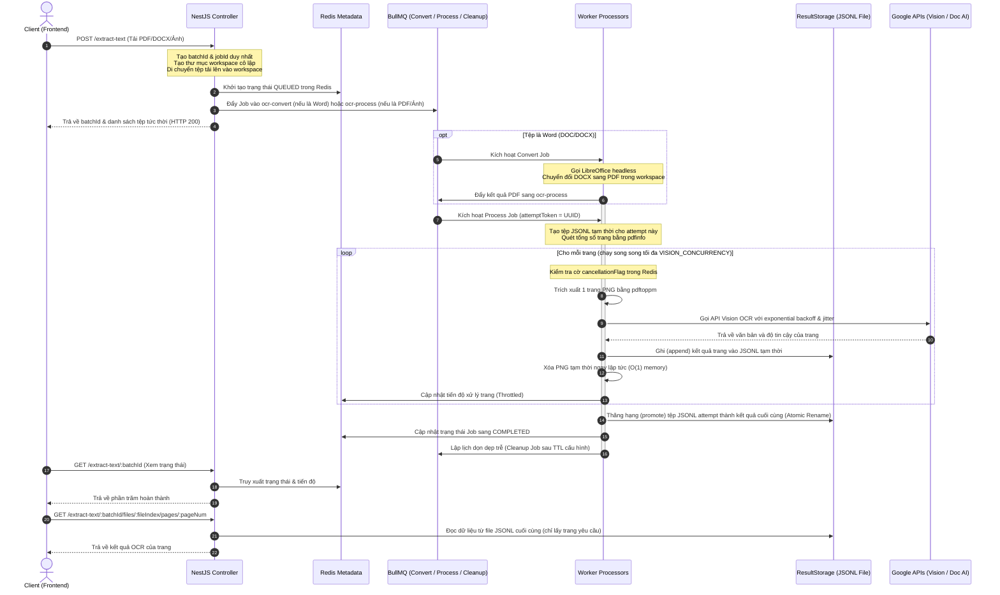

# DataExtract AI - NestJS Backend API & Vận Hành Hệ Thống

Tài liệu này cung cấp hướng dẫn toàn diện về kiến trúc, cách thiết lập, vận hành và các bài học kinh nghiệm thiết kế thực tế của hệ thống Backend DataExtract AI. Hệ thống được xây dựng trên nền tảng **NestJS** để phục vụ việc trích xuất bảng biểu (Table Extraction) và nhận diện văn bản (OCR) quy mô lớn, hỗ trợ xử lý bất đồng bộ qua hàng đợi **BullMQ + Redis**, điều phối tài nguyên thông minh và hỗ trợ phân trang tối ưu hiệu năng.

Tài liệu này được viết chi tiết để đảm bảo một kỹ sư mới tiếp cận dự án có thể hiểu rõ kiến trúc hệ thống, cài đặt môi trường và tiếp tục phát triển mà không gặp rào cản.

---

## 🗺️ 1. Kiến Trúc Hệ Thống (System Architecture)

Hệ thống áp dụng kiến trúc **Xử lý tài liệu bất đồng bộ cô lập (Asynchronous Document Processing Architecture)**. Mọi tác vụ nặng (chuyển đổi định dạng, tách trang, gọi API đám mây) đều được tách khỏi luồng HTTP Request-Response chính để đảm bảo tính sẵn sàng cao của API.

### Sơ Đồ Luồng Hoạt Động (Architecture Flowchart)



### Các Thành Phần Cốt Lõi (Core Components)

1. **Phân Tách Hàng Đợi (Queue Isolation)**:
   - Các tác vụ được phân bổ độc lập cho cả luồng OCR và Trích xuất bảng:
     - `ocr-convert` & `table-convert`: Xử lý chuyển đổi Word sang PDF qua LibreOffice headless. Concurrency được giới hạn riêng bởi `LIBREOFFICE_CONCURRENCY`. Lỗi chuyển đổi tệp Word hỏng không gây nghẽn luồng xử lý ảnh/PDF có sẵn.
     - `ocr-process` & `table-process`: Phụ trách render trang PDF/Ảnh và thực hiện nhận diện Vision OCR hoặc trích xuất cấu trúc bảng qua Document AI. Xử lý nhiều tài liệu cùng lúc qua `PROCESS_WORKER_CONCURRENCY`.
     - `ocr-cleanup` & `table-cleanup`: Tác vụ ngầm dọn dẹp thư mục tạm thời của Job sau thời gian chờ `JOB_CLEANUP_TTL_MS`.
2. **Lưu Trữ Kết Quả Độc Lập (Decoupled Result Storage)**:
   - Các kết quả quét (chứa toạ độ, chữ và cấu trúc bảng phức tạp) được lưu trực tiếp vào các tệp **Line-Delimited JSON (JSONL)** ở ổ đĩa thay vì lưu trữ trong Redis. Redis chỉ lưu trữ trạng thái tiến trình (metadata) nhỏ và nhẹ.
3. **Lazy Load Phân Trang**:
   - Khi người dùng lấy chi tiết trang qua API phân trang, backend mở tệp JSONL tương ứng và chỉ lấy đúng dòng ứng với trang yêu cầu, không nạp toàn bộ file kết quả vào RAM.

---

## ⚙️ 2. Hướng Dẫn Thiết Lập Môi Trường (Setup Guide)

Đảm bảo cài đặt đầy đủ các dịch vụ phụ trợ dưới đây để hệ thống vận hành ổn định.

### 2.1 Google Cloud Platform Credentials
Hệ thống sử dụng **Google Cloud Vision API** và **Document AI**. Bạn cần cấu hình một Service Account:
1. Truy cập [Google Cloud Console](https://console.cloud.google.com/).
2. Chọn dự án của bạn > **IAM & Admin** > **Service Accounts** > Chọn **Create Service Account**.
3. Cấp các vai trò (Roles) tối thiểu sau:
   - `Document AI API User`
   - `Cloud Vision API User`
4. Chuyển sang tab **Keys** > **Add Key** > **Create new key** (chọn định dạng JSON).
5. Lưu file tải về vào thư mục bảo mật trong máy (ví dụ: `C:\gcp-keys\table-extractor-credentials.json` hoặc lưu trực tiếp trong thư mục dự án với tên `summer-optics-501702-q5-a1a63929c753.json` theo biến cấu hình).
6. Thiết lập biến môi trường hệ thống chỉ đến file JSON trên:
   - **Windows (PowerShell)**: `$env:GOOGLE_APPLICATION_CREDENTIALS="C:\gcp-keys\table-extractor-credentials.json"`
   - **Linux / macOS**: `export GOOGLE_APPLICATION_CREDENTIALS="/path/to/table-extractor-credentials.json"`

### 2.2 Khởi Chạy Redis
Dịch vụ này quản lý hàng đợi và cache trạng thái công việc của BullMQ.
- **Docker (Khuyên Dùng)**:
  ```bash
  docker run -d --name table-extractor-redis -p 6379:6379 --restart always redis:7-alpine
  ```

### 2.3 Cài Đặt Poppler PDF Tools
Hệ thống xử lý PDF page-by-page thông qua các công cụ CLI `pdfinfo` và `pdftoppm` của Poppler.
- **Trên Windows**:
  1. Tải bản Poppler cho Windows.
  2. Giải nén và đặt các tệp thực thi `pdfinfo.exe` và `pdftoppm.exe` vào đúng thư mục sau ở gốc dự án:
     `Release-26.02.0-0/poppler-26.02.0/Library/bin/`
- **Trên Linux (Ubuntu/Debian)**:
  ```bash
  sudo apt update && sudo apt install poppler-utils -y
  ```

### 2.4 Cài Đặt LibreOffice (Chuyển Đổi Word sang PDF)
Hệ thống gọi LibreOffice qua CLI chạy headless để chuyển đổi tài liệu `.doc`/`.docx` thành `.pdf`.
- **Trên Windows**:
  1. Tải và cài đặt LibreOffice từ trang chủ.
  2. Đảm bảo đường dẫn cài đặt mặc định là: `C:\Program Files\LibreOffice\program\soffice.exe` (hoặc cấu hình trong `.env` thông qua biến môi trường thích hợp).
- **Trên Linux (Ubuntu/Debian)**:
  ```bash
  sudo apt update && sudo apt install libreoffice -y
  ```

### 2.5 Cấu Hìn Tệp `.env`
Tạo tệp `.env` tại thư mục gốc backend (`table_extract/.env`):
```env
PORT=3000

# Cấu hình kết nối Redis (BullMQ)
REDIS_HOST=localhost
REDIS_PORT=6379

# Cấu hình GCP
GOOGLE_PROJECT_ID=summer-optics-501702-q5
GOOGLE_LOCATION=us
GOOGLE_PROCESSOR_ID=your-document-ai-processor-id

# Cấu hình tham số OCR & Table AI
JOB_RETRY_ATTEMPTS=5           # Số lần thử lại tối đa cho GCP API
JOB_TIMEOUT=600000             # Thời gian tối đa chạy 1 Job (10 phút)
JOB_CLEANUP_TTL_MS=3600000     # Thời gian dọn dẹp workspace sau khi hoàn thành (1 giờ)
MAX_PDF_PAGES=2000             # Giới hạn số trang tối đa cho 1 file PDF
MAX_UPLOAD_SIZE=52428800       # Giới hạn kích thước file upload (50MB)

# Cấu hình luồng chạy song song (Tuning Concurrency)
LIBREOFFICE_CONCURRENCY=2      # Số luồng chuyển đổi Word song song
PROCESS_WORKER_CONCURRENCY=2   # Số luồng xử lý Job song song (OCR/Table)
VISION_CONCURRENCY=5           # Số trang quét song song tối đa trên mỗi tài liệu PDF
```

### 2.6 Lệnh Vận Hành Dự Án
```bash
# 1. Cài đặt các thư viện
pnpm install

# 2. Khởi chạy dự án ở chế độ phát triển (Development)
pnpm run start:dev

# 3. Biên dịch dự án ra phiên bản sản xuất (Production Build)
pnpm run build
pnpm run start:prod

# 4. Chạy kiểm thử (Unit Tests)
pnpm test
```

---

## 🚀 3. Các Bài Học Kinh Nghiệm & Giải Pháo Thiết Kế Kiến Trúc (Core Engineering Lessons Learned)

*Dưới đây là đúc kết kinh nghiệm từ quá trình phát triển, tối ưu hiệu năng và xử lý các lỗi nghiêm trọng ở môi trường tải cao khi xử lý tài liệu lớn.*

### 3.1 Bài Học 1: Tránh "Cơn Ác Mộng" Quá Tải Redis Bằng Decoupled Storage Pattern
- **Vấn đề**: Ban đầu, chúng tôi lưu trữ toàn bộ dữ liệu kết quả trích xuất (bao gồm chữ, toạ độ góc, cấu trúc bảng biểu chi tiết) trực tiếp vào Redis làm giá trị của Job. Với các tệp tài liệu PDF lớn (>100 trang), dữ liệu JSON thô trả về từ GCP Vision hoặc Document AI rất đồ sộ (thường từ 5MB đến hơn 20MB cho mỗi tệp). Khi chạy đồng thời nhiều Job, Redis I/O bị bão hòa, RAM của Redis tăng vọt làm sập dịch vụ do lỗi OOM (Out Of Memory) hoặc gây nghẽn mạng nghiêm trọng.
- **Giải pháp**: 
  - **Tách biệt dữ liệu**: Redis chỉ đóng vai trò lưu trữ metadata nhỏ (trạng thái `status`, tiến độ `%`, `jobId`, `attemptToken`).
  - **Lưu trữ tệp phẳng**: Kết quả trích xuất chi tiết được lưu trữ dưới dạng tệp **JSONL (JSON Lines)** trên ổ đĩa cục bộ tại đường dẫn `uploads/results/<jobId>.jsonl`. Mỗi dòng trong tệp JSONL đại diện cho kết quả của một trang đơn lẻ.
  - **Lazy Loading**: Khi Client yêu cầu kết quả của một trang cụ thể, hệ thống sẽ mở tệp JSONL, đọc tuần tự và trả về duy nhất dòng ứng với trang đó mà không nạp toàn bộ tệp vào RAM.
- **Bài học**: Không bao giờ lưu trữ dữ liệu dạng blob lớn vào Redis. Redis sinh ra để truy cập nhanh các cấu trúc dữ liệu nhỏ, việc nạp dữ liệu lớn sẽ làm mất đi ưu thế tốc độ và gây mất ổn định hệ thống.

### 3.2 Bài Học 2: Đảm Bảo Dung Lượng RAM Hằng Số $O(1)$ Cho Tài Liệu Lớn (Page-by-Page Streaming)
- **Vấn đề**: Khi người dùng tải lên một PDF dài 500 trang, nếu nạp toàn bộ tài liệu vào bộ nhớ hoặc render đồng loạt tất cả 500 ảnh trang PDF để xử lý song song, bộ nhớ RAM của máy chủ sẽ cạn kiệt lập tức, dẫn đến tiến trình Node.js bị hệ điều hành tắt (chết do lỗi `SIGKILL` hoặc `Out of memory`).
- **Giải pháp**:
  - **Chia nhỏ tài liệu**: Sử dụng `pdfinfo` để đọc siêu dữ liệu tài liệu. Sau đó, dùng `pdftoppm` (cho OCR) hoặc `pdf-lib` (cho Table Extraction) cắt PDF gốc thành từng trang đơn và ghi tạm vào thư mục workspace của Job (`uploads/<jobId>/`).
  - **Giới hạn song song**: Sử dụng thư viện điều phối luồng (`p-limit` tích hợp trong `ConcurrencyService`) để khống chế tối đa `VISION_CONCURRENCY` (ví dụ: tối đa 5 trang được xử lý song song).
  - **Dọn dẹp cuốn chiếu**: Ngay khi trang $i$ nhận được phản hồi từ GCP API, kết quả lập tức được ghi nối tiếp vào tệp JSONL tạm trên đĩa, và tệp ảnh/PDF của trang $i$ đó sẽ bị xóa (`fs.unlink`) ngay lập tức.
- **Bài học**: Giữ bộ nhớ RAM ở mức tối thiểu và không đổi bất kể kích thước tệp lớn đến đâu. Luôn thiết kế cơ chế dọn dẹp tệp tạm ngay lập tức sau khi hoàn thành đơn vị công việc nhỏ nhất.

### 3.3 Bài Học 3: Cơ Chế Idempotent & Atomic Promotion Để Phòng Ngừa Tranh Chấp (Race Condition)
- **Vấn đề**: Khi một Job bị thất bại ở trang 50/100 và hệ thống tự động thử lại (Retry), hoặc khi hai Worker vô tình xử lý cùng một Job do cơ chế phân bổ trùng lặp của hàng đợi, việc ghi trực tiếp vào một tệp kết quả duy nhất `<jobId>.jsonl` sẽ dẫn đến tình trạng chồng chéo dữ liệu (dữ liệu rác xen kẽ) hoặc xung đột ghi đè tệp.
- **Giải pháp**:
  - **Cô lập lượt chạy**: Mỗi lượt chạy Job được sinh ra một mã `attemptToken` (UUID). Worker sẽ ghi dữ liệu vào tệp tạm `<jobId>_<attemptToken>.jsonl`.
  - **Thăng hạng nguyên tử (Atomic Promotion)**: Chỉ khi toàn bộ các trang của tài liệu được xử lý thành công không lỗi, hệ thống mới đổi tên (rename) tệp tạm thành tệp kết quả cuối cùng `<jobId>.jsonl`. Lệnh `rename` của hệ điều hành là một thao tác nguyên tử (atomic operation), đảm bảo tệp kết quả đích luôn ở trạng thái hoàn chỉnh 100%.
  - **Vấn đề ranh giới thiết bị (EXDEV Fallback)**: Trên môi trường container (Docker/Kubernetes), thư mục chứa tệp tạm và thư mục lưu trữ kết quả cuối cùng có thể nằm trên hai phân vùng ổ đĩa (mount points) khác nhau. Khi đó, lệnh `fs.rename` của Node.js sẽ ném ra lỗi `EXDEV: cross-device link not permitted`. Hệ thống phải thiết kế một cơ chế dự phòng: sao chép tệp nguồn sang một tệp `.tmp` ở thư mục đích, gọi lệnh `fsync` trên file handle để đảm bảo dữ liệu được ghi vật lý xuống ổ cứng hoàn toàn, sau đó đổi tên nguyên tử tại cùng phân vùng và xóa tệp tạm nguồn.
- **Bài học**: Đừng bao giờ tin tưởng tuyệt đối vào hệ thống tệp trong môi trường phân tán. Luôn dự phòng các lỗi phân mảnh đĩa (`EXDEV`) và áp dụng mô hình ghi tạm -> thăng hạng nguyên tử để bảo toàn tính toàn vẹn dữ liệu.

### 3.4 Bài Học 4: Hủy Tác Vụ Chủ Động (Cooperative Job Cancellation) Để Tiết Kiệm Tài Nguyên
- **Vấn đề**: Khi người dùng tải lên một tệp tài liệu 300 trang và nhấn nút "Hủy" trên giao diện vì phát hiện nhầm tệp, nếu hệ thống tiếp tục chạy ngầm cho đến hết, nó sẽ làm lãng phí rất nhiều tài nguyên CPU/mạng và làm tăng chi phí sử dụng API Google Cloud không đáng có.
- **Giải pháp**:
  - **Cờ hủy**: Khi người dùng yêu cầu hủy, API cập nhật cờ `cancellationFlag: true` vào Redis của Job đó.
  - **Kiểm tra chủ động**: Worker ngầm không thể bị tắt ngang một cách thô bạo (vì sẽ làm hỏng trạng thái hàng đợi BullMQ). Thay vào đó, Worker áp dụng cơ chế "hợp tác tự nguyện" (cooperative check). Trước khi gửi yêu cầu của trang kế tiếp lên Google API và sau khi nhận kết quả, Worker sẽ gọi nhanh vào Redis kiểm tra cờ `cancellationFlag`.
  - **Hủy lập tức**: Nếu phát hiện cờ hủy đã được dựng, tiến trình lập tức dừng vòng lặp trang, thực hiện xóa sạch workspace tạm thời và đổi trạng thái Job sang `CANCELLED`.
- **Bài học**: Xử lý bất đồng bộ trong nền cần được thiết kế có khả năng kiểm soát từ bên ngoài. Cơ chế hủy chủ động giúp hệ thống tiết kiệm hàng ngàn đô-la chi phí API GCP khi người dùng thao tác nhầm.

### 3.5 Bài Học 5: Thiết Kế Server-Sent Events (SSE) Trong NestJS & Cách Khắc Phục Rò Rỉ Bộ Nhớ
- **Vấn đề**: Để hiển thị thanh tiến độ thời gian thực cho Client, chúng tôi sử dụng cơ chế Server-Sent Events (SSE) thay vì Polling liên tục. Tuy nhiên, nếu Client đột ngột ngắt kết nối (ví dụ: F5 tải lại trang, mất mạng), backend không giải phóng bộ đếm thời gian (`setInterval` trong RxJS Observable) sẽ dẫn đến rò rỉ bộ nhớ nghiêm trọng, làm sụt giảm tài nguyên máy chủ sau vài ngày vận hành.
- **Giải pháp**:
  - Thiết lập hàm dọn dẹp (cleanup function) trong khối khai báo RxJS `Observable`. Khi kết nối SSE kết thúc (Client đóng kết nối hoặc Observable hoàn thành), hàm callback dọn dẹp sẽ tự động được kích hoạt để xóa bộ đếm `clearInterval`.
  - **Lưu ý về cấu trúc phản hồi của NestJS SSE**: NestJS decorator `@Sse()` tự động đóng gói dữ liệu phát ra vào cấu trúc `{ data: T }`. Phía Client khi nhận sự kiện qua thư viện `EventSource` của trình duyệt phải bóc tách dữ liệu dưới dạng `const message = JSON.parse(event.data).data || JSON.parse(event.data)` để tránh lỗi dữ liệu lồng nhau.
- **Bài học**: Luôn dọn dẹp các tài nguyên nền (timers, event listeners, file descriptors) khi luồng stream bất đồng bộ kết thúc.

### 3.6 Bài Học 6: Exponential Backoff & Jitter Để Kháng Lỗi Rate Limit (GCP API Quota)
- **Vấn đề**: Mặc dù cấu hình giới hạn song song trang, nhưng khi có nhiều người dùng cùng tải tài liệu lên cùng lúc, số lượng request gửi đến Google API vẫn có thể vượt quá hạn mức (quota) cho phép của Google Cloud Project, dẫn đến lỗi HTTP `429 Too Many Requests`. Nếu thử lại ngay lập tức và đồng loạt, hệ thống sẽ tự làm nghẽn chính mình (Thundering Herd Problem).
- **Giải pháp**:
  - Tích hợp cơ chế tự động thử lại (Retry) với khoảng thời gian chờ tăng dần theo cấp số nhân (exponential backoff) kết hợp với độ lệch ngẫu nhiên (jitter):
    $$\text{Delay} = 2^{\text{attempt}} \times 1000 \text{ ms} + \text{Random Jitter}$$
  - Cơ chế này giúp phân tán thời điểm gửi lại yêu cầu của các Worker, giúp giảm thiểu đáng kể lỗi Rate Limit và tăng tỷ lệ hoàn thành công việc thành công ở môi trường tải cao.
- **Bài học**: Luôn thiết kế cơ chế tự động thử lại thông minh với backoff và jitter cho bất kỳ dịch vụ tích hợp API bên thứ ba nào.

---

## 🛠️ 4. Hướng Dẫn Bảo Trì & Khắc Phục Sự Cố (Maintenance & Troubleshooting)

### 4.1 Các Lỗi Thường Gặp và Cách Xử Lý

| Triệu Chứng / Lỗi | Nguyên Nhân Gây Ra | Giải Pháp Khắc Phục |
| :--- | :--- | :--- |
| **Lỗi `ENOENT` khi gọi `pdfinfo` hoặc `pdftoppm`** | Chưa cài đặt Poppler PDF Tools hoặc đặt sai thư mục chạy. | Đảm bảo các file `.exe` nằm đúng trong thư mục `Release-26.02.0-0/poppler-26.02.0/Library/bin/` đối với Windows hoặc đã cài đặt `poppler-utils` trên Linux. Kiểm tra biến môi trường. |
| **Không chuyển đổi được tệp Word (.docx) sang PDF** | Đường dẫn thực thi LibreOffice bị sai hoặc LibreOffice bị treo ngầm. | Kiểm tra đường dẫn cài đặt mặc định của LibreOffice (`C:\Program Files\LibreOffice\program\soffice.exe`). Trên Linux, chạy `which libreoffice` để xác định vị trí. |
| **Lỗi `EXDEV: cross-device link not permitted`** | Đổi tên tệp tạm (`rename`) xuyên qua các ổ đĩa vật lý hoặc phân vùng Docker mount khác nhau. | Hệ thống đã tích hợp fallback tự động copy-fsync-rename trong `LocalFileResultStorageService`. Hãy đảm bảo thư mục tạm `uploads/` và thư mục kết quả có quyền ghi (`write permission`). |
| **Lỗi HTTP 403 / 401 khi gọi Google Cloud API** | Thiếu file Credentials hoặc Service Account chưa được cấp quyền truy cập. | Kiểm tra biến môi trường `GOOGLE_APPLICATION_CREDENTIALS` đã chỉ đúng file JSON key chưa. Đảm bảo Service Account có quyền `Document AI API User` và `Cloud Vision API User`. |
| **Lỗi `OutOfMemory` hoặc Redis bị sập** | Lưu trữ dữ liệu lớn trong Redis hoặc cấu hình `PROCESS_WORKER_CONCURRENCY` quá cao. | Giảm số luồng chạy song song trong tệp `.env`. Hãy đảm bảo không tự viết code lưu kết quả OCR trực tiếp vào các hash/key của Redis. |

### 4.2 Giám Sát Hệ Thống Bằng Dashboard Trực Quan
Hệ thống tích hợp sẵn thư viện **Bull Board** để giám sát trạng thái hàng đợi BullMQ thời gian thực.
- Địa chỉ truy cập: `http://localhost:<PORT>/admin/queues` (mặc định cổng `3000`).
- Giao diện này cho phép:
  - Xem số lượng công việc đang chờ xử lý (`waiting`), đang chạy (`active`), đã hoàn thành (`completed`), thất bại (`failed`).
  - Xem chi tiết nguyên nhân lỗi của các job thất bại (`failedReason`).
  - Kích hoạt chạy lại (Retry) thủ công hoặc xóa các job bị treo.

### 4.3 Quản Lý Dung Lượng Bộ Nhớ Đĩa (Disk Space Management)
- Hệ thống có cơ chế tự động dọn dẹp các tệp tin tạm thời (tệp PDF gốc, ảnh cắt lẻ từng trang) thông qua hàng đợi `cleanup` sau thời gian chờ `JOB_CLEANUP_TTL_MS` (mặc định 1 giờ).
- Tuy nhiên, các tệp kết quả cuối cùng `.jsonl` tại thư mục `uploads/results/` sẽ được **giữ lại vô hạn** để phục vụ người dùng tải xuống sau này.
- **Khuyến nghị**: Trên môi trường Production, nên thiết lập một tác vụ lập trình định kỳ (Cron Job của hệ điều hành) để tự động xóa các file `.jsonl` có tuổi thọ lớn hơn 30 ngày để giải phóng dung lượng đĩa:
  - **Lệnh Linux**: `find uploads/results/ -name "*.jsonl" -mtime +30 -exec rm {} \;`

---

## 📡 5. Tài Liệu Các API Endpoints Chính (API Endpoints Reference)

### A. Nhận Diện Văn Bản (Text OCR)
- **Tạo Batch OCR**: `POST /extract-text` (nhận tệp `multipart/form-data`)
- **Huỷ Job đang chạy**: `POST /jobs/:id/cancel`
- **Xem tiến trình & SSE Stream**: `GET /extract-text/:batchId/stream` (Trạng thái kết nối giữ nguyên Server-Sent Events)
- **Lấy nội dung một trang (Lazy Load)**: `GET /extract-text/:batchId/files/:fileIndex/pages/:pageNumber`

### B. Trích Xuất Bảng Biểu (Table Extraction)
- **Tạo Batch Trích xuất bảng**: `POST /extract-tables` (nhận tệp `multipart/form-data`)
- **Huỷ Job đang chạy**: `POST /jobs/:id/cancel`
- **Xem tiến trình & SSE Stream**: `GET /extract-tables/:batchId/stream`
- **Lấy cấu trúc bảng một trang (Lazy Load)**: `GET /extract-tables/:batchId/files/:fileIndex/pages/:pageNumber`
- **Xuất kết quả ra file Excel**: `POST /export-excel` (Chuyển cấu trúc bảng trích xuất thành tệp Excel `.xlsx` tải về)

---

## 🚀 6. Hướng Dẫn Dành Cho Nhà Phát Triển Tiếp Theo (Developer Handbook)

Nếu bạn là người tiếp theo bảo trì dự án này, hãy lưu ý:
1. **Luôn tuân thủ cơ chế ghi tệp tạm trước khi thăng hạng**: Nếu cần thay đổi dịch vụ lưu trữ (ví dụ: chuyển sang lưu Amazon S3), hãy viết một class mới kế thừa giao diện `ResultStorage` tại `src/shared/interfaces/result-storage.interface.ts` và thực hiện tương tự: ghi đè file nháp của attempt lên S3 rồi tiến hành đổi tên nguyên tử hoặc thăng hạng.
2. **Kiểm soát tốt concurrency**: Khi tích hợp thêm công cụ AI mới, luôn khai báo các tham số giới hạn luồng chạy song song trong `.env` và sử dụng `ConcurrencyService` để quản lý tài nguyên. Tránh sử dụng các vòng lặp `Promise.all` không giới hạn trên mảng lớn.
3. **Giữ cho các Module độc lập**: Cấu trúc thư mục được chia theo Route (`src/routes/...`) và Hàng đợi (`src/queues/...`). Nếu muốn bổ sung luồng phân tích mới (ví dụ: nhận diện hóa đơn - Invoice Extraction), hãy tạo một Module route mới và một Queue Processor mới riêng biệt, tránh viết lồng chéo logic vào các module OCR và Table Extraction hiện có.
