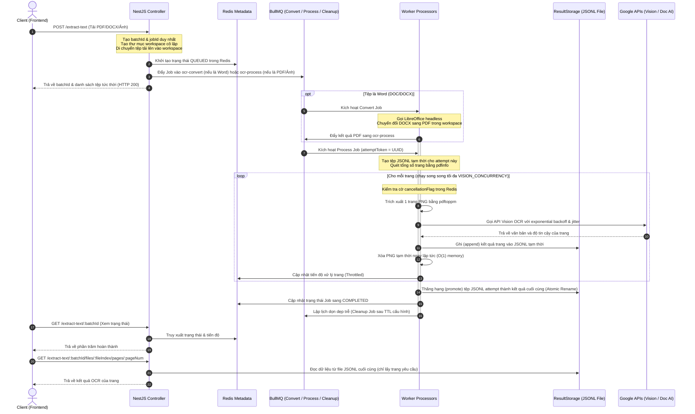

# DataExtract AI - NestJS Backend API & Vận Hành Hệ Thống

Tài liệu này cung cấp hướng dẫn toàn diện về kiến trúc, cách thiết lập, vận hành và các bài học kinh nghiệm thiết kế thực tế của hệ thống Backend DataExtract AI. Hệ thống được xây dựng trên nền tảng **NestJS** để phục vụ việc trích xuất bảng biểu (Table Extraction) và nhận diện văn bản (OCR) quy mô lớn, hỗ trợ xử lý bất đồng bộ qua hàng đợi **BullMQ + Redis**, điều phối tài nguyên thông minh và hỗ trợ phân trang tối ưu hiệu năng.

Tài liệu này được viết chi tiết để đảm bảo một kỹ sư mới tiếp cận dự án có thể hiểu rõ kiến trúc hệ thống, cài đặt môi trường và tiếp tục phát triển mà không gặp rào cản.

---

## 🗺️ 1. Kiến Trúc Hệ Thống (System Architecture)

Hệ thống áp dụng kiến trúc **Xử lý tài liệu bất đồng bộ cô lập (Asynchronous Document Processing Architecture)**. Mọi tác vụ nặng (chuyển đổi định dạng, tách trang, gọi API đám mây) đều được tách khỏi luồng HTTP Request-Response chính để đảm bảo tính sẵn sàng cao của API.

### Sơ Đồ Luồng Hoạt Động (Architecture Flowchart)



### Các Thành Phần Cốt Lõi (Core Components)

1. **Phân Tách Hàng Đợi (Queue Isolation)**:
   - Các tác vụ được phân bổ độc lập cho cả luồng OCR và Trích xuất bảng:
     - `ocr-convert` & `table-convert`: Xử lý chuyển đổi Word sang PDF qua LibreOffice headless. Concurrency được giới hạn riêng bởi `LIBREOFFICE_CONCURRENCY`. Lỗi chuyển đổi tệp Word hỏng không gây nghẽn luồng xử lý ảnh/PDF có sẵn.
     - `ocr-process` & `table-process`: Phụ trách render trang PDF/Ảnh và thực hiện nhận diện Vision OCR hoặc trích xuất cấu trúc bảng qua Document AI. Xử lý nhiều tài liệu cùng lúc qua `PROCESS_WORKER_CONCURRENCY`.
     - `ocr-cleanup` & `table-cleanup`: Tác vụ ngầm dọn dẹp thư mục tạm thời của Job sau thời gian chờ `JOB_CLEANUP_TTL_MS`.
2. **Lưu Trữ Kết Quả Độc Lập (Decoupled Result Storage)**:
   - Các kết quả quét (chứa toạ độ, chữ và cấu trúc bảng phức tạp) được lưu trực tiếp vào các tệp **Line-Delimited JSON (JSONL)** ở ổ đĩa thay vì lưu trữ trong Redis. Redis chỉ lưu trữ trạng thái tiến trình (metadata) nhỏ và nhẹ.
3. **Lazy Load Phân Trang**:
   - Khi người dùng lấy chi tiết trang qua API phân trang, backend mở tệp JSONL tương ứng và chỉ lấy đúng dòng ứng với trang yêu cầu, không nạp toàn bộ file kết quả vào RAM.

---

## ⚙️ 2. Hướng Dẫn Thiết Lập Môi Trường (Setup Guide)

Đảm bảo cài đặt đầy đủ các dịch vụ phụ trợ dưới đây để hệ thống vận hành ổn định.

### 2.1 Google Cloud Platform Credentials

Hệ thống sử dụng **Google Cloud Vision API** và **Document AI**. Bạn cần cấu hình một Service Account:

1. Truy cập [Google Cloud Console](https://console.cloud.google.com/).
2. Chọn dự án của bạn > **IAM & Admin** > **Service Accounts** > Chọn **Create Service Account**.
3. Cấp các vai trò (Roles) tối thiểu sau:
   - `Document AI API User`
   - `Cloud Vision API User`
4. Chuyển sang tab **Keys** > **Add Key** > **Create new key** (chọn định dạng JSON).
5. Lưu file tải về vào thư mục bảo mật trong máy (ví dụ: `C:\gcp-keys\table-extractor-credentials.json` hoặc lưu trực tiếp trong thư mục dự án với tên `summer-optics-501702-q5-a1a63929c753.json` theo biến cấu hình).
6. Thiết lập biến môi trường hệ thống chỉ đến file JSON trên:
   - **Windows (PowerShell)**: `$env:GOOGLE_APPLICATION_CREDENTIALS="C:\gcp-keys\table-extractor-credentials.json"`
   - **Linux / macOS**: `export GOOGLE_APPLICATION_CREDENTIALS="/path/to/table-extractor-credentials.json"`

### 2.2 Khởi Chạy Redis

Dịch vụ này quản lý hàng đợi và cache trạng thái công việc của BullMQ.

- **Docker (Khuyên Dùng)**:
  ```bash
  docker run -d --name table-extractor-redis -p 6379:6379 --restart always redis:7-alpine
  ```

### 2.3 Cài Đặt Poppler PDF Tools

Hệ thống xử lý PDF page-by-page thông qua các công cụ CLI `pdfinfo` và `pdftoppm` của Poppler.

- **Trên Windows**:
  1. Tải bản Poppler cho Windows.
  2. Giải nén và đặt các tệp thực thi `pdfinfo.exe` và `pdftoppm.exe` vào đúng thư mục sau ở gốc dự án:
     `Release-26.02.0-0/poppler-26.02.0/Library/bin/`
- **Trên Linux (Ubuntu/Debian)**:
  ```bash
  sudo apt update && sudo apt install poppler-utils -y
  ```

### 2.4 Cài Đặt LibreOffice (Chuyển Đổi Word sang PDF)

Hệ thống gọi LibreOffice qua CLI chạy headless để chuyển đổi tài liệu `.doc`/`.docx` thành `.pdf`.

- **Trên Windows**:
  1. Tải và cài đặt LibreOffice từ trang chủ.
  2. Đảm bảo đường dẫn cài đặt mặc định là: `C:\Program Files\LibreOffice\program\soffice.exe` (hoặc cấu hình trong `.env` thông qua biến môi trường thích hợp).
- **Trên Linux (Ubuntu/Debian)**:
  ```bash
  sudo apt update && sudo apt install libreoffice -y
  ```

### 2.5 Cấu Hìn Tệp `.env`

Tạo tệp `.env` tại thư mục gốc backend (`table_extract/.env`):

```env
PORT=3000

# Cấu hình kết nối Redis (BullMQ)
REDIS_HOST=localhost
REDIS_PORT=6379

# Cấu hình GCP
GOOGLE_PROJECT_ID=summer-optics-501702-q5
GOOGLE_LOCATION=us
GOOGLE_PROCESSOR_ID=your-document-ai-processor-id

# Cấu hình tham số OCR & Table AI
JOB_RETRY_ATTEMPTS=5           # Số lần thử lại tối đa cho GCP API
JOB_TIMEOUT=600000             # Thời gian tối đa chạy 1 Job (10 phút)
JOB_CLEANUP_TTL_MS=3600000     # Thời gian dọn dẹp workspace sau khi hoàn thành (1 giờ)
MAX_PDF_PAGES=2000             # Giới hạn số trang tối đa cho 1 file PDF
MAX_UPLOAD_SIZE=52428800       # Giới hạn kích thước file upload (50MB)

# Cấu hình luồng chạy song song (Tuning Concurrency)
LIBREOFFICE_CONCURRENCY=2      # Số luồng chuyển đổi Word song song
PROCESS_WORKER_CONCURRENCY=2   # Số luồng xử lý Job song song (OCR/Table)
VISION_CONCURRENCY=5           # Số trang quét song song tối đa trên mỗi tài liệu PDF
```

### 2.6 Lệnh Vận Hành Dự Án

```bash
# 1. Cài đặt các thư viện
pnpm install

# 2. Khởi chạy dự án ở chế độ phát triển (Development)
pnpm run start:dev

# 3. Biên dịch dự án ra phiên bản sản xuất (Production Build)
pnpm run build
pnpm run start:prod

# 4. Chạy kiểm thử (Unit Tests)
pnpm test
```

---

## 🚀 3. Các Bài Học Kinh Nghiệm & Giải Pháp Thiết Kế (Core Lessons Learned)

_Các đúc kết kỹ thuật quan trọng rút ra trong quá trình thiết kế hệ thống xử lý tài liệu tải cao:_

### 3.1 Tách biệt lưu trữ (Decoupled Storage) tránh quá tải Redis

- **Vấn đề**: Lưu kết quả OCR/Table lớn (>10-20MB/tài liệu) trực tiếp vào Redis gây tràn RAM và nghẽn I/O Redis.
- **Giải pháp**: Redis chỉ lưu siêu dữ liệu (trạng thái, tiến trình). Kết quả chi tiết được ghi nối tiếp vào đĩa cứng dưới dạng **JSONL (JSON Lines)**.
- **Bài học**: Giữ Redis gọn nhẹ, hỗ trợ Lazy Loading (chỉ đọc đúng dòng của trang được yêu cầu từ tệp JSONL).

### 3.2 Tối ưu RAM $O(1)$ bằng cách xử lý trang cuốn chiếu (Page-by-Page)

- **Vấn đề**: Nạp toàn bộ tài liệu PDF hàng trăm trang vào RAM để xử lý gây crash tiến trình (`SIGKILL`).
- **Giải pháp**: Cắt nhỏ PDF gốc thành từng trang ảnh/PDF đơn lẻ, xử lý song song giới hạn bởi `VISION_CONCURRENCY`, ghi kết quả và **xoá ngay tệp trang tạm** sau khi xong.
- **Bài học**: Giữ lượng RAM tiêu thụ cố định bất kể tệp dài 5 hay 500 trang.

### 3.3 Đổi tên nguyên tử (Atomic Promotion) phòng ngừa race conditions

- **Vấn đề**: Các lượt chạy lại (Retry) hoặc nhiều Worker ghi đè/xung đột vào cùng một tệp kết quả.
- **Giải pháp**: Mỗi lượt chạy có một UUID `attemptToken` riêng biệt, ghi vào `<jobId>_<attemptToken>.jsonl`. Khi hoàn thành 100%, thực hiện đổi tên nguyên tử (`rename`) thành `<jobId>.jsonl`.
- **EXDEV Fallback**: Trong Docker, đổi tên xuyên phân vùng đĩa sẽ ném lỗi `EXDEV`. Giải pháp: sao chép tệp tạm sang thư mục đích, gọi `fsync` đồng bộ hóa dữ liệu xuống đĩa cứng vật lý rồi mới đổi tên và xóa tệp tạm nguồn.

### 3.4 Huỷ tác vụ chủ động (Cooperative Cancellation) tiết kiệm chi phí

- **Vấn đề**: Người dùng huỷ tác vụ khi đang chạy, nếu Worker tiếp tục xử lý sẽ gây lãng phí tài nguyên và chi phí Google Cloud API.
- **Giải pháp**: Đặt cờ huỷ trong Redis. Worker chủ động kiểm tra cờ này trước và sau mỗi trang được gửi đi. Nếu cờ bật, lập tức dừng vòng lặp, xoá thư mục tạm và chuyển trạng thái sang `CANCELLED`.

### 3.5 Quản lý kết nối SSE (Server-Sent Events) tránh rò rỉ bộ nhớ

- **Vấn đề**: Client ngắt kết nối (F5 hoặc mất mạng) nhưng backend không hủy `setInterval` trong RxJS Observable gây rò rỉ bộ nhớ RAM.
- **Giải pháp**: Đăng ký hàm dọn dẹp `clearInterval` trong hàm callback của Observable.
- **Lưu ý SSE**: NestJS `@Sse()` tự động bọc dữ liệu trong thuộc tính `data` lồng nhau, client cần parse `event.data` hai lần.

### 3.6 Exponential Backoff kết hợp Jitter tránh lỗi Rate Limit (429)

- **Vấn đề**: Request đồng loạt từ nhiều Worker gửi lên GCP API làm vượt quá hạn mức quota.
- **Giải pháp**: Tích hợp cơ chế tự động thử lại (Retry) với độ trễ tăng dần theo cấp số nhân kết hợp với khoảng trễ ngẫu nhiên (Jitter) giúp phân tán đều các yêu cầu thử lại.

---

## 🛠️ 4. Hướng Dẫn Bảo Trì & Khắc Phục Sự Cố (Maintenance & Troubleshooting)

### 4.1 Các Lỗi Thường Gặp và Cách Xử Lý

| Triệu Chứng / Lỗi                                   | Nguyên Nhân Gây Ra                                                                           | Giải Pháp Khắc Phục                                                                                                                                                                     |
| :-------------------------------------------------- | :------------------------------------------------------------------------------------------- | :-------------------------------------------------------------------------------------------------------------------------------------------------------------------------------------- |
| **Lỗi `ENOENT` khi gọi `pdfinfo` hoặc `pdftoppm`**  | Chưa cài đặt Poppler PDF Tools hoặc đặt sai thư mục chạy.                                    | Đảm bảo các file `.exe` nằm đúng trong thư mục `Release-26.02.0-0/poppler-26.02.0/Library/bin/` đối với Windows hoặc đã cài đặt `poppler-utils` trên Linux. Kiểm tra biến môi trường.   |
| **Không chuyển đổi được tệp Word (.docx) sang PDF** | Đường dẫn thực thi LibreOffice bị sai hoặc LibreOffice bị treo ngầm.                         | Kiểm tra đường dẫn cài đặt mặc định của LibreOffice (`C:\Program Files\LibreOffice\program\soffice.exe`). Trên Linux, chạy `which libreoffice` để xác định vị trí.                      |
| **Lỗi `EXDEV: cross-device link not permitted`**    | Đổi tên tệp tạm (`rename`) xuyên qua các ổ đĩa vật lý hoặc phân vùng Docker mount khác nhau. | Hệ thống đã tích hợp fallback tự động copy-fsync-rename trong `LocalFileResultStorageService`. Hãy đảm bảo thư mục tạm `uploads/` và thư mục kết quả có quyền ghi (`write permission`). |
| **Lỗi HTTP 403 / 401 khi gọi Google Cloud API**     | Thiếu file Credentials hoặc Service Account chưa được cấp quyền truy cập.                    | Kiểm tra biến môi trường `GOOGLE_APPLICATION_CREDENTIALS` đã chỉ đúng file JSON key chưa. Đảm bảo Service Account có quyền `Document AI API User` và `Cloud Vision API User`.           |
| **Lỗi `OutOfMemory` hoặc Redis bị sập**             | Lưu trữ dữ liệu lớn trong Redis hoặc cấu hình `PROCESS_WORKER_CONCURRENCY` quá cao.          | Giảm số luồng chạy song song trong tệp `.env`. Hãy đảm bảo không tự viết code lưu kết quả OCR trực tiếp vào các hash/key của Redis.                                                     |

### 4.2 Giám Sát Hệ Thống Bằng Dashboard Trực Quan

Hệ thống tích hợp sẵn thư viện **Bull Board** để giám sát trạng thái hàng đợi BullMQ thời gian thực.

- Địa chỉ truy cập: `http://localhost:<PORT>/admin/queues` (mặc định cổng `3000`).
- Giao diện này cho phép:
  - Xem số lượng công việc đang chờ xử lý (`waiting`), đang chạy (`active`), đã hoàn thành (`completed`), thất bại (`failed`).
  - Xem chi tiết nguyên nhân lỗi của các job thất bại (`failedReason`).
  - Kích hoạt chạy lại (Retry) thủ công hoặc xóa các job bị treo.

### 4.3 Quản Lý Dung Lượng Bộ Nhớ Đĩa (Disk Space Management)

- Hệ thống có cơ chế tự động dọn dẹp các tệp tin tạm thời (tệp PDF gốc, ảnh cắt lẻ từng trang) thông qua hàng đợi `cleanup` sau thời gian chờ `JOB_CLEANUP_TTL_MS` (mặc định 1 giờ).
- Tuy nhiên, các tệp kết quả cuối cùng `.jsonl` tại thư mục `uploads/results/` sẽ được **giữ lại vô hạn** để phục vụ người dùng tải xuống sau này.
- **Khuyến nghị**: Trên môi trường Production, nên thiết lập một tác vụ lập trình định kỳ (Cron Job của hệ điều hành) để tự động xóa các file `.jsonl` có tuổi thọ lớn hơn 30 ngày để giải phóng dung lượng đĩa:
  - **Lệnh Linux**: `find uploads/results/ -name "*.jsonl" -mtime +30 -exec rm {} \;`

---

## 📡 5. Tài Liệu Các API Endpoints Chính (API Endpoints Reference)

### A. Nhận Diện Văn Bản (Text OCR)

- **Tạo Batch OCR**: `POST /extract-text` (nhận tệp `multipart/form-data`)
- **Huỷ Job đang chạy**: `POST /jobs/:id/cancel`
- **Xem tiến trình & SSE Stream**: `GET /extract-text/:batchId/stream` (Trạng thái kết nối giữ nguyên Server-Sent Events)
- **Lấy nội dung một trang (Lazy Load)**: `GET /extract-text/:batchId/files/:fileIndex/pages/:pageNumber`

### B. Trích Xuất Bảng Biểu (Table Extraction)

- **Tạo Batch Trích xuất bảng**: `POST /extract-tables` (nhận tệp `multipart/form-data`)
- **Huỷ Job đang chạy**: `POST /jobs/:id/cancel`
- **Xem tiến trình & SSE Stream**: `GET /extract-tables/:batchId/stream`
- **Lấy cấu trúc bảng một trang (Lazy Load)**: `GET /extract-tables/:batchId/files/:fileIndex/pages/:pageNumber`
- **Xuất kết quả ra file Excel**: `POST /export-excel` (Chuyển cấu trúc bảng trích xuất thành tệp Excel `.xlsx` tải về)
