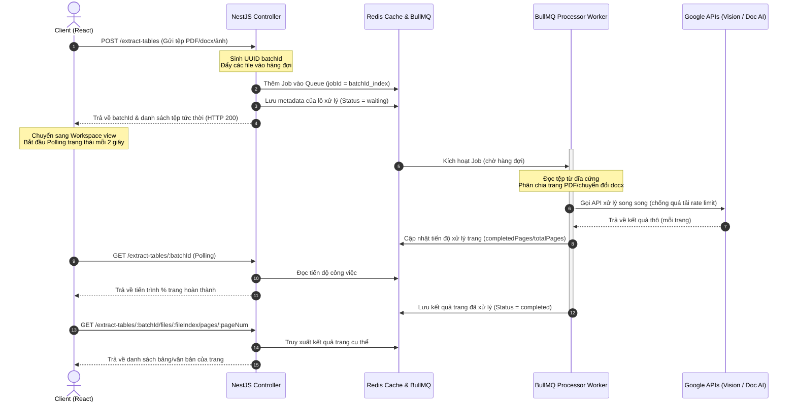

# Kiến Trúc Hệ Thống (System Architecture)

Tài liệu này mô tả chi tiết kiến trúc xử lý tài liệu bất đồng bộ (Asynchronous Document Processing Architecture) của hệ thống backend NestJS.

---

## 📊 Sơ Đồ Hoạt Động (Architecture Flowchart)

Dưới đây là sơ đồ Mermaid mô tả luồng dữ liệu từ khi Client tải tài liệu lên cho đến khi xử lý ngầm và lazy-load kết quả:

---

## 🛠️ Các Thành Phần Cốt Lõi (Core Components)

### 1. Hàng đợi BullMQ & Redis
- **Mục tiêu**: Đóng vai trò là hàng đợi phân tán (Distributed Task Queue) giúp backend không bị nghẽn luồng xử lý chính khi gặp file PDF nặng (vài trăm trang) hoặc có nhiều người dùng đồng thời (50+ concurrent users).
- **Hàng đợi hiện có**:
  - `ocr-queue`: Dành cho luồng nhận dạng chữ Google Vision OCR.
  - `table-queue`: Dành cho luồng trích xuất cấu trúc bảng Google Document AI.
- **Dữ liệu tạm thời (TTL)**: Trạng thái và kết quả trích xuất được lưu trữ tạm thời trong Redis với thời gian hết hạn là **24 giờ** (`BATCH_TTL_SECONDS`), tránh tích tụ rác bộ nhớ.

### 2. Dịch vụ Điều phối Concurrency (`ConcurrencyService`)
- Để tối ưu hóa và chống lỗi Rate Limiting (Quá tải quota của Google Cloud API), hệ thống sử dụng hai luồng quản lý concurrency:
  - **Global Concurrency**: Giới hạn tổng số request gửi đi Google song song trên toàn hệ thống (ví dụ: tối đa 10).
  - **Page Concurrency**: Giới hạn số trang xử lý song song trên một tài liệu (ví dụ: tối đa 5).
- Các request vượt ngưỡng sẽ tự động xếp hàng đợi và xử lý cuốn chiếu (concurrency pool).

### 3. Tự động Thử lại và Backoff (Error Resilience)
- Khi Google API gặp sự cố nghẽn mạng tạm thời (HTTP 429 hoặc 503), BullMQ được cấu hình tự động thử lại tối đa **3 lần** (`attempts: 3`).
- Khoảng cách giữa các lần thử lại tuân theo cơ chế **Exponential Backoff** (ví dụ: trễ tăng dần 5s, 10s, 20s...) giúp dịch vụ tự phục hồi hiệu quả.

### 4. Phân Trang và Bỏ Qua Trang Trống (Page Skipping optimization)
- **OCR**: Chỉ lưu trữ văn bản và độ tin cậy của trang có dữ liệu chữ.
- **Table Extraction**: Bộ xử lý worker lọc bỏ các trang trống không có bảng biểu. Chỉ các trang chứa bảng dữ liệu mới được lưu vào danh sách `tablePageNumbers`. Frontend dựa vào danh sách này để phân trang thông minh, chỉ cho phép người dùng click duyệt qua các trang có bảng biểu thực tế, tăng tốc độ tương tác gấp nhiều lần.
