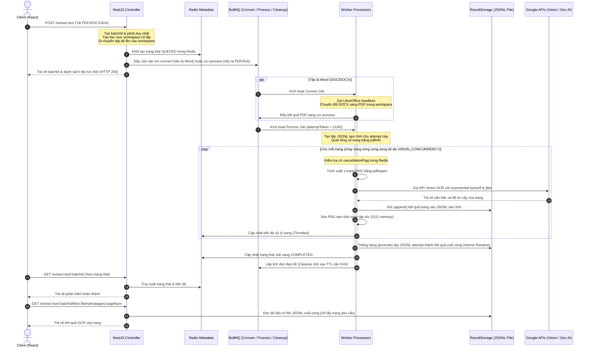

# Kiến Trúc Hệ Thống (System Architecture)

Tài liệu này mô tả chi tiết kiến trúc xử lý tài liệu bất đồng bộ cô lập (Asynchronous Document Processing Architecture) của hệ thống backend NestJS sau đợt refactor thành bản Production-Ready.

---

## 📊 Sơ Đồ Hoạt Động (Architecture Flowchart)

Dưới đây là sơ đồ Mermaid mô tả luồng dữ liệu của phiên bản mới:

---

## 🛠️ Các Thành Phần Cốt Lõi (Core Components)

### 1. Phân Tách Hàng Đợi (Queue Isolation)
Để tránh tắc nghẽn hàng đợi chính, các tác vụ được phân bổ độc lập cho cả luồng OCR và Trích xuất bảng:
- `ocr-convert` & `table-convert`: Concurrency được giới hạn riêng bởi `LIBREOFFICE_CONCURRENCY`. Lỗi chuyển đổi Word không gây nghẽn luồng xử lý ảnh/PDF.
- `ocr-process` & `table-process`: Phụ trách render trang PDF/Ảnh và thực hiện nhận diện Vision OCR hoặc trích xuất Document AI. Xử lý nhiều tài liệu cùng lúc qua `PROCESS_WORKER_CONCURRENCY`.
- `ocr-cleanup` & `table-cleanup`: Tác vụ chạy ngầm giải phóng dung lượng đĩa cứng bằng cách xoá thư mục workspace của Job sau thời gian chờ `JOB_CLEANUP_TTL_MS`.

### 2. Tách Biệt Bộ Lưu Trữ Kết Quả (Decoupled ResultStorage)
- **Vấn đề**: Lưu kết quả OCR nặng hoặc cấu trúc bảng biểu phức tạp khổng lồ (>10MB đối với các PDF hàng trăm trang) trực tiếp vào Redis sẽ làm nghẽn I/O Redis, tăng tiêu thụ RAM và gây sập dịch vụ.
- **Giải pháp**:
  - Redis **chỉ** lưu giữ metadata trạng thái nhỏ (status, progress, cancellation flag).
  - Toàn bộ kết quả trang OCR và bảng biểu được ghi trực tiếp vào ổ đĩa dưới dạng tệp JSONL (`uploads/results/<jobId>.jsonl`).
  - Khi người dùng lấy chi tiết trang qua API phân trang (lazy load), backend sẽ mở tệp JSONL và chỉ lấy đúng dòng tương ứng với trang đó mà không nạp toàn bộ tệp vào RAM.

### 3. Đảm Bảo Tính Idempotency & Attempt Isolation
- Mỗi lần chạy lại (retry) sinh ra một `attemptToken` (UUID) mới. Dữ liệu tạm thời được ghi vào `<jobId>_<attemptToken>.jsonl` tránh race condition khi hai tiến trình cùng chạy một Job.
- Chỉ khi toàn bộ trang hoàn thành xuất sắc, hệ thống mới tiến hành đổi tên nguyên tử (atomic promotion) tệp tạm thời thành tệp đích `<jobId>.jsonl`. Nếu rename thất bại do khác thiết bị lưu trữ (`EXDEV`), hệ thống thực hiện sao chép, `fsync` đồng bộ, đổi tên và dọn dẹp tệp nguồn để đảm bảo tệp kết quả cuối cùng không bao giờ bị ghi đè dở dang.

### 4. Huỷ Job Chủ Động & Tiết Kiệm RAM (O(1) Memory Overhead)
- Người dùng có thể dừng các Job nặng bằng cách gửi yêu cầu huỷ. Hệ thống cập nhật cờ huỷ trong Redis cho cả hai luồng OCR và trích xuất bảng.
- Các worker kiểm tra cờ huỷ trước khi xử lý mỗi trang. Nếu phát hiện cờ huỷ, tác vụ sẽ dừng ngay lập tức, xoá các tệp ảnh/PDF trang tạm thời và giải phóng tài nguyên.
- Bộ nhớ RAM được giữ ở mức cực thấp và không đổi: tệp ảnh của mỗi trang PDF được xoá ngay khi OCR xong, và các cấu trúc bảng được đẩy xuống ổ đĩa, giúp máy chủ xử lý mượt mà các file PDF hàng nghìn trang.

