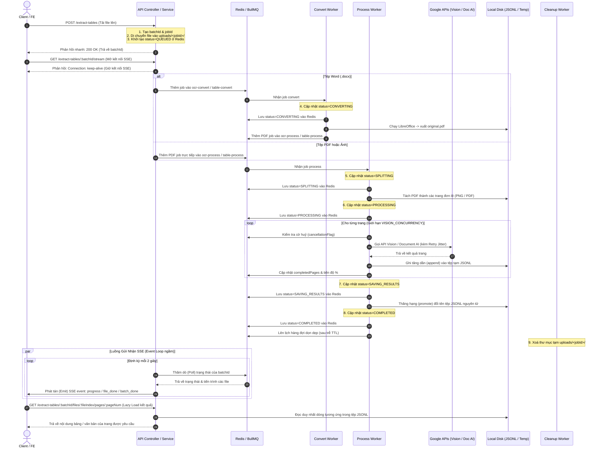

# Kiến Trúc Luồng Chạy Hệ Thống (Pipeline Execution Flow)

Tài liệu này mô tả chi tiết đường đi của một tệp tin (luồng xử lý bất đồng bộ) từ khi người dùng tải lên cho đến khi kết quả được trích xuất hoàn tất và bộ nhớ tạm được giải phóng. Kiến trúc này được áp dụng đồng bộ cho cả luồng **Nhận diện văn bản (OCR)** và **Trích xuất bảng biểu (Table Extraction)**.

---

## 🗺️ Sơ Đồ Luồng Tổng Quan (High-Level Sequence)



---

## ⚙️ Các Giai Đoạn Chi Tiết (Detailed Steps)

### Giai Đoạn 1: Tiếp Nhận & Khởi Tạo (Ingestion & Initialization)
1. **Kiểm tra & Chuẩn hoá**:
   - Client gửi tệp thông qua `multipart/form-data`.
   - Hệ thống chuyển đổi tên tệp gốc từ hệ ký tự latin1 sang UTF-8 để hiển thị đúng tiếng Việt.
2. **Khởi tạo định danh & Khác biệt hoá**:
   - Sinh ra `batchId` cho toàn bộ lô, và `jobId` định dạng `<batchId>_<index>` cho từng tệp.
3. **Cô lập không gian làm việc (Workspace Isolation)**:
   - Tạo thư mục làm việc riêng tại `uploads/<jobId>/`.
   - Di chuyển tệp đã upload từ thư mục tạm của Multer vào `uploads/<jobId>/original.<ext>`.
4. **Đăng ký trạng thái**:
   - Ghi trạng thái ban đầu lên Redis: `status: JobState.QUEUED` và tiến độ `progress: { completed: 0, total: 0 }`.
   - Nếu đuôi mở rộng là Word (`.doc`/`.docx`), job được đẩy vào hàng đợi `convert`. Ngược lại (PDF, hình ảnh), job được xếp thẳng vào hàng đợi `process`.

---

### Giai Đoạn 2: Chuyển Đổi Tài Liệu (Document Conversion)
*Chỉ áp dụng cho tệp Word (`.doc`/`.docx`)*
1. **Tiếp nhận**: `TableConvertProcessor` / `ConvertProcessor` nhận tác vụ.
2. **Cập nhật**: Trạng thái chuyển thành `JobState.CONVERTING`.
3. **Thực thi chuyển đổi**:
   - Chạy lệnh headless của LibreOffice (`soffice.exe` trên Windows) để kết xuất tệp `original.pdf` trong thư mục `uploads/<jobId>/`.
4. **Xếp lịch tiếp theo**:
   - Đẩy thông tin tệp PDF mới tạo vào hàng đợi `process` để xử lý bước tiếp theo.
   - Nếu chuyển đổi thất bại, tác vụ lập tức chuyển thành `FAILED` và lên lịch dọn dẹp ngay lập tức (delay: 0).

---

### Giai Đoạn 3: Chia Nhỏ & Trích Xuất Song Song (Splitting & Parallel Extraction)
1. **Tiếp nhận & Đếm trang (Splitting)**:
   - `TableProcessProcessor` / `ProcessProcessor` nhận tác vụ xử lý PDF / Ảnh.
   - Trạng thái chuyển thành `JobState.SPLITTING`.
   - Sử dụng công cụ `pdfinfo` hoặc thư viện `pdf-lib` để xác định chính xác số lượng trang thực tế (`totalPages`).
   - Cắt tệp gốc thành các tệp tạm cho từng trang (OCR xuất thành ảnh PNG bằng `pdftoppm`; Table Extraction xuất thành tệp PDF trang đơn lẻ).
2. **Xử lý trích xuất (Processing)**:
   - Trạng thái chuyển thành `JobState.OCR_PROCESSING` (được ghi nhận trong Redis là `active`).
   - Tạo một chuỗi `attemptToken` (UUID) đại diện cho lượt chạy này để chống xung đột ghi đè.
   - Xếp lịch xử lý song song các trang (giới hạn bởi biến `VISION_CONCURRENCY` thông qua thư viện `p-limit` và `ConcurrencyService`).
3. **Cơ chế huỷ chủ động (Cooperative Cancellation)**:
   - Trước và sau khi gọi API đám mây (Vision API / Document AI), worker luôn kiểm tra cờ `cancellationFlag` trong Redis.
   - Nếu người dùng bấm nút **Huỷ tác vụ**, worker sẽ dừng lập tức, xoá tệp kết quả tạm thời và chuyển trạng thái thành `CANCELLED`.
4. **Gọi API đám mây & Retry**:
   - Mỗi trang được gọi đến API của Google để trích xuất dữ liệu.
   - Trường hợp lỗi tạm thời (Rate Limit 429 hoặc lỗi 50x từ GCP), hệ thống sẽ tự động thử lại (tối đa `JOB_RETRY_ATTEMPTS` lần) với cơ chế trễ tăng dần (exponential backoff) kết hợp nhiễu ngẫu nhiên (jitter).
5. **Lưu trữ tuần tự & Cập nhật tiến độ**:
   - Kết quả trích xuất của trang được ghi nối tiếp (append) trực tiếp xuống đĩa cứng thành file JSONL tạm thời: `uploads/results/<jobId>_<attemptToken>.jsonl` để tránh chiếm dụng RAM của hệ thống (O(1) memory footprint).
   - Cập nhật tiến độ trang hoàn thành về Redis để Client nhận biết qua SSE / Polling.

---

### Giai Đoạn 4: Thăng Hạng & Hoàn Tất (Promotion & Completion)
1. **Lưu trữ nguyên tử (Atomic Promotion)**:
   - Khi toàn bộ các trang hoàn thành thành công, trạng thái chuyển thành `JobState.SAVING_RESULTS`.
   - Hệ thống tiến hành thăng hạng kết quả bằng cách đổi tên file (atomic rename) từ `<jobId>_<attemptToken>.jsonl` thành `<jobId>.jsonl`. 
   - Có cơ chế fallback: Nếu đổi tên khác phân vùng đĩa (`EXDEV`), hệ thống sẽ tự động sao chép, đồng bộ dữ liệu (`fsync`), đổi tên và giải phóng file nguồn an toàn.
2. **Hoàn tất**:
   - Cập nhật Redis: `status: JobState.COMPLETED`, ghi nhận `completedAt`.
3. **Lập lịch dọn dẹp trễ (Delayed Cleanup)**:
   - Thêm một job vào hàng đợi `cleanup` với thời gian trễ `JOB_CLEANUP_TTL_MS` (mặc định 1 giờ).

---

### Giai Đoạn 5: Dọn Dẹp Workspace (Background Cleanup)
1. **Kích hoạt**: `TableCleanupProcessor` / `CleanupProcessor` nhận tác vụ dọn dẹp.
2. **Dọn dẹp**:
   - Xoá sạch toàn bộ thư mục workspace `uploads/<jobId>/` (chứa file gốc, tệp PDF trung gian, các trang đơn lẻ).
   - Tệp kết quả cuối cùng tại `uploads/results/<jobId>.jsonl` vẫn được giữ lại để người dùng tải xuống hoặc xem trực tuyến.
   - Tác vụ dọn dẹp được thiết kế có tính idempotent (nếu thư mục đã được xoá trước đó do lỗi/huỷ, tiến trình sẽ kết thúc thành công mà không ném ra lỗi).

---

### Giai Đoạn 6: Tương Tác Giữa Frontend & Backend (FE-BE Interaction)

Dưới đây là cách mà Frontend kết hợp cùng các API Backend để hiển thị kết quả thời gian thực:

1. **Khởi động Tiến trình (Trigger)**:
   - FE gửi tệp dữ liệu lên qua API `POST /extract-tables` hoặc `POST /extract-text`.
   - BE phản hồi ngay lập tức mã `200 OK` kèm theo `batchId` và danh sách các `jobId` đang ở trạng thái `waiting`. FE chuyển giao diện sang màn hình theo dõi (Workspace).

2. **Theo dõi Tiến độ Thời gian thực (Real-time Stream)**:
   - FE mở một kết nối Server-Sent Events (SSE) đến địa chỉ:
     `GET /extract-tables/:batchId/stream` hoặc `GET /extract-text/:batchId/stream`
   - **BE xử lý emit**: Controller sử dụng `@Sse()` decorator để trả về một RxJS `Observable`. Định kỳ mỗi 2 giây, service thăm dò Redis và gọi `subscriber.next({ data: { type, ... } })`:
     ```typescript
     // Backend NestJS Controller
     @Sse(':batchId/stream')
     streamProgress(@Param('batchId') batchId: string) {
       return this.extractTablesService.streamBatchProgress(batchId);
     }
     
     // Backend NestJS Service (RxJS Observable)
     streamBatchProgress(batchId: string): Observable<any> {
       return new Observable((subscriber) => {
         const intervalId = setInterval(async () => {
           // Đọc dữ liệu tiến độ từ Redis
           const status = await this.getTableJobStatus(jobId);
           // Phát sự kiện đi (Emit)
           subscriber.next({
             data: { type: 'progress', completed: status.progress.completed, total: status.progress.total }
           });
           if (hoan_thanh_tat_ca) {
             subscriber.next({ data: { type: 'batch_done' } });
             subscriber.complete(); // Đóng stream
           }
         }, 2000);
         return () => clearInterval(intervalId); // Tự động dọn dẹp khi ngắt kết nối
       });
     }
     ```
   - **FE nhận và xử lý (Consume)**: FE sử dụng API Native `EventSource` của trình duyệt để lắng nghe sự kiện phát ra từ BE:
     ```javascript
     const eventSource = new EventSource(`http://localhost:3000/extract-tables/${batchId}/stream`);
     eventSource.onmessage = (event) => {
       const message = JSON.parse(event.data);
       if (message.type === 'progress') {
         // Cập nhật thanh tiến trình % tương ứng trên UI
         updateProgress(message.fileIndex, message.completed, message.total);
       } else if (message.type === 'batch_done') {
         eventSource.close(); // Đóng kết nối an toàn khi hoàn thành
       }
     };
     ```
   - FE nhận sự kiện SSE, cập nhật giao diện thanh tiến trình (progress bar) tương ứng với từng file.

3. **Huỷ Tác vụ Chủ động (Action Cancel)**:
   - Trong lúc các file đang chờ (`waiting`) hoặc đang chạy (`active`), người dùng có thể bấm nút **🚫 Huỷ tác vụ** trên FE.
   - FE gửi yêu cầu `POST /jobs/:id/cancel` đến BE.
   - BE cập nhật cờ huỷ trong Redis. Các worker ngầm phát hiện cờ huỷ sẽ dừng lập tức, dọn dẹp file tạm, và thông báo trạng thái `failed` / `cancelled` cho FE thông qua luồng SSE đang mở.

4. **Tải dữ liệu Phân trang (Lazy Loading Results)**:
   - Khi luồng SSE phát đi sự kiện `batch_done` hoặc file chuyển sang trạng thái `completed`, FE sẽ tiến hành lấy danh sách trang có chứa kết quả thông qua API:
     `GET /extract-tables/:batchId/files/:fileIndex` (Phân trang kết quả bảng nhẹ)
   - Do tệp kết quả rất nặng và đã được lưu ngoài Redis dưới dạng tệp JSONL trên ổ đĩa, FE không tải toàn bộ cấu trúc bảng/văn bản của tất cả các trang về cùng một lúc.
   - Khi người dùng lướt qua hoặc chọn một trang cụ thể (ví dụ: Trang 2), FE sẽ gọi API Lazy Load:
     `GET /extract-tables/:batchId/files/:fileIndex/pages/2`
   - BE nhận yêu cầu, mở tệp JSONL của Job, dùng thư viện để đọc duy nhất dòng tương ứng với trang 2, trả về nội dung bảng và đóng tệp ngay lập tức. Điều này giúp tối ưu hóa băng thông truyền tải và dung lượng RAM của cả Client lẫn Server.
